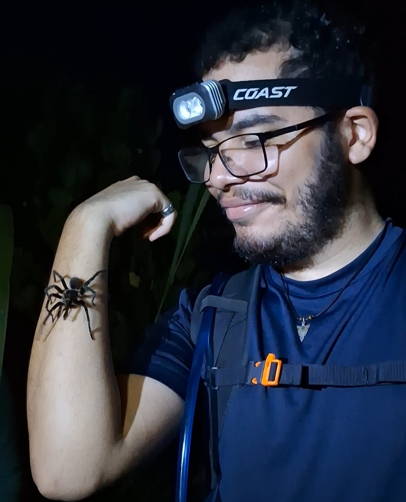

# This is my first Rmd.
## About me:

- I am __Edwin__ 
* I like **ants!** 
- My favorite species is __*Temnothorax isabellae*__.

## Other ant species from Puerto Rico:
- __Native species:__
  * *Nylanderia semitincta*
  * *Platythyrea punctata*
  * *Odontomachus sp.*
- __Introduced species:__
  * *Wasmannia auropunctata*
  * *Solenopsis invicta*
  * *Paratrechina longicornis*

## Assignments

### [R Tutorial 1](rtutorials/rtutorial1_edwin.html)
### [R Tutorial 2](rtutorials/rtutorial2_edwin.html)

